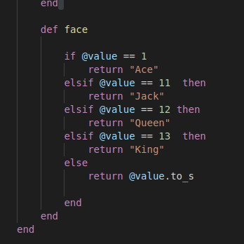

# Deck of Cards

## Description

This Deck of Cards project is a program to create a deck of cards, shuffle them, return a card and check for data integrity. I used Test Driven Devolopment, Ruby and rspec to accomplish this.

## Installation

to clone this project locally and run the rspec tests, do the folowing:

- insure you have ruby installed on your machine

```bash
git clone <your_repo.url>
cd <your_repo>
rspec
```

## Usage

The first piece of functionality I did was to create code to make the numbers into the 'face' of the card. If the number received was a 1 the program converts that into an 'Ace', 11 to 'Jack', 12 to 'Queen', 13 to 'King'. If the number was from 2 to 10, the program returns the number as a string, 2 = '2', 3 = '3' etc.


Then I created a nested loop to send the numbers and suits to the card class to be converted into actual playing cards(the first piece of functionality). I then created a shuffle method and a draw method to pull out a card. All that was left was to create the methods that ensure data integrity.

## Roadmap

I would like to use this program in the future to create some card games, maybe Blackjack or something similar. Pull request and/or suggestions are welcome. I do have a question, though. Can anyone explain to me why Ruby likes this code:

```
if ["hearts", "diamonds", "spades", "clubs"].include?(@suit)
            @suit = suit
        else
            raise ArgumentError
        end
```

more than this code:

```
if ["hearts", "diamonds", "spades", "clubs"].exclude?(@suit)
            raise ArgumentError
        else
            @suit = suit
        end
```

The first code block does exactly what it should, it raises an ArgumentError when @suit is 'not a suit'. The second code block causes all of the tests related to card_spec.rb file to fail.
